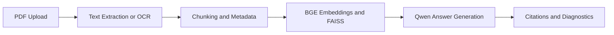

# sourceground-rag
Open-source RAG chatbot for source-grounded PDF question answering
# SourceGround

SourceGround is an open-source Retrieval-Augmented Generation (RAG) application for evidence-backed PDF question answering. It processes digital and scanned PDFs, creates metadata-aware vector indexes, and returns grounded answers with page-level citations and retrieval diagnostics.

## Live Application

https://sourceground-rag.streamlit.app/

## Features

- Digital PDF text extraction using PyMuPDF
- Automatic Tesseract OCR fallback for scanned pages
- Natural-boundary text chunking with overlap
- Source, page, document type, document group, and OCR metadata
- BGE embeddings using the lightweight ONNX FastEmbed runtime
- FAISS cosine-similarity vector retrieval
- Automatic metadata-aware routing
- Manual document-type filtering
- Open-source Qwen 2.5 answer generation
- Suggested questions generated from each newly indexed document
- Page-level citations and supporting evidence
- Confidence, chunk count, routing, similarity, and latency diagnostics
- Per-session index isolation to prevent documents from different users or uploads from mixing
- Responsive interface compatible with light and dark themes

## RAG Pipeline



## Technology Stack

- **Interface:** Streamlit
- **PDF processing:** PyMuPDF
- **OCR:** Tesseract and pytesseract
- **Embedding model:** BAAI/bge-small-en-v1.5
- **Embedding runtime:** FastEmbed and ONNX Runtime
- **Vector index:** FAISS
- **Language model:** Qwen2.5-0.5B-Instruct-GGUF
- **Model runtime:** llama.cpp
- **Deployment:** Streamlit Community Cloud

## Model Configuration

The Streamlit portfolio deployment uses:

`Qwen/Qwen2.5-0.5B-Instruct-GGUF`

with the `Q4_K_M` quantization.

This configuration reduces memory usage so the application can operate within Streamlit Community Cloud's CPU and memory limits.

The accompanying capstone notebook uses the larger:

`Qwen/Qwen2.5-1.5B-Instruct`

model on a Google Colab T4 GPU.

Both versions use the same RAG architecture:

1. Document processing
2. OCR when required
3. Metadata tagging
4. Chunking
5. Embedding generation
6. FAISS retrieval
7. Context construction
8. Grounded prompting
9. Open-source LLM generation
10. Citations and retrieval diagnostics

## Running Locally

Install the required system dependencies:

```bash
sudo apt-get update
sudo apt-get install -y build-essential cmake libopenblas-dev tesseract-ocr
```

Create a Python 3.11 environment and install the application:

```bash
python -m venv .venv
source .venv/bin/activate
pip install -r requirements.txt
streamlit run streamlit_app.py
```

The first run downloads the public embedding and Qwen model files. Later runs use the local model cache.

## Deploying on Streamlit Community Cloud

1. Upload the following files to the root of a GitHub repository:

```text
streamlit_app.py
requirements.txt
packages.txt
README.md
.streamlit/config.toml
```

2. Open Streamlit Community Cloud.
3. Select the GitHub repository.
4. Select the `main` branch.
5. Enter the following main file path:

```text
streamlit_app.py
```

6. Open **Advanced settings**.
7. Select **Python 3.11**.
8. Press **Deploy**.

The first deployment may take several minutes because the model runtime must be compiled and the model files must be downloaded.

## Confidence Interpretation

The displayed confidence is the average semantic similarity of the retrieved document chunks.

It measures retrieval relevance and is not a calibrated probability that the generated answer is correct. Users should review the displayed source pages when making important decisions.

## Privacy and Session Isolation

Uploaded documents are indexed separately for each Streamlit user session. Processing a new upload completely replaces the session's previous FAISS index, preventing an older document from being used accidentally.

Temporary PDF files are removed after processing.

## Project Context

SourceGround was developed as a capstone project demonstrating a complete Retrieval-Augmented Generation pipeline with:

- Digital and scanned document support
- Metadata-aware routing
- Open-source embeddings
- FAISS retrieval
- Open-source language-model generation
- Source-grounded prompting
- Citation enforcement
- Confidence and performance diagnostics
- A deployment-ready user interface

## License

This project is available under the Apache 2.0 License.
